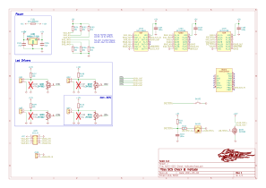

# Overview

This PCB is created to check the validity of the Systems Critical Signals (SCS) coming from other parts of the car. 

The board is designed to drive 12V LEDs.

By default, the respective outputs (meant for LEDs) are in their safe-state, that being ON.

Furthermore, to test if the board is still working, there is an additional input to a button to "test" the board's circuitry.

### Failure detection means

Since the safe-state of the car is that of LEDs being turned ON, there exists a failure where the board and/or LEDs do not recieve Vcc due to a blown fuse on this board or that the LV is not functioning.

The "test" button (a momentary NO button), when depressed, will invert the indicator light until its release. This will serve as a sanity check when debugging any potential failures. 

In the event that the signal to turn on or off the LED is faulty, the indicator will not switch its state when "test" is triggered. 

In the event that the (fused) Vcc for LEDs and the board does not supply Vcc, triggering the "test" button will have the indicators stay OFF as there is no power supplying Vcc, likewise the "test" button having an indicator on it too will lack its illumination.

### Schematic

### Connections

Refer to NVF2 Right Dashboard Packaging for the proposed hook-up schematic.
