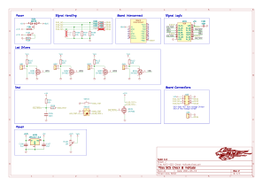
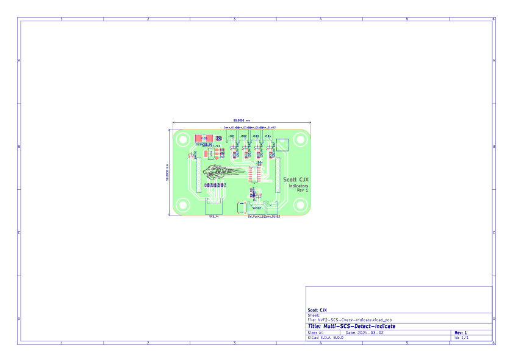
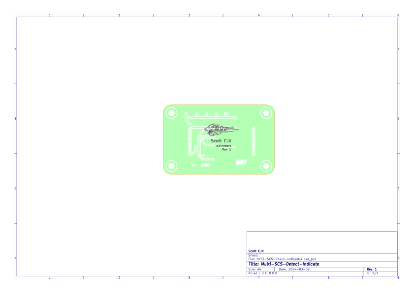
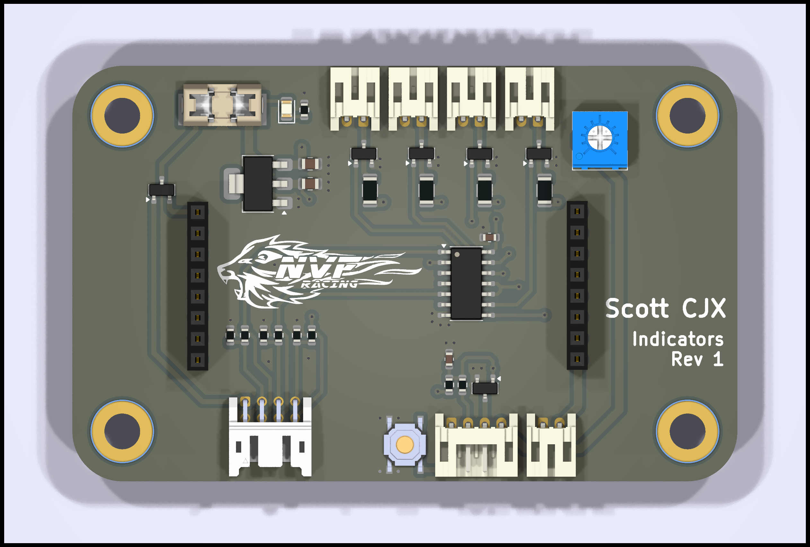
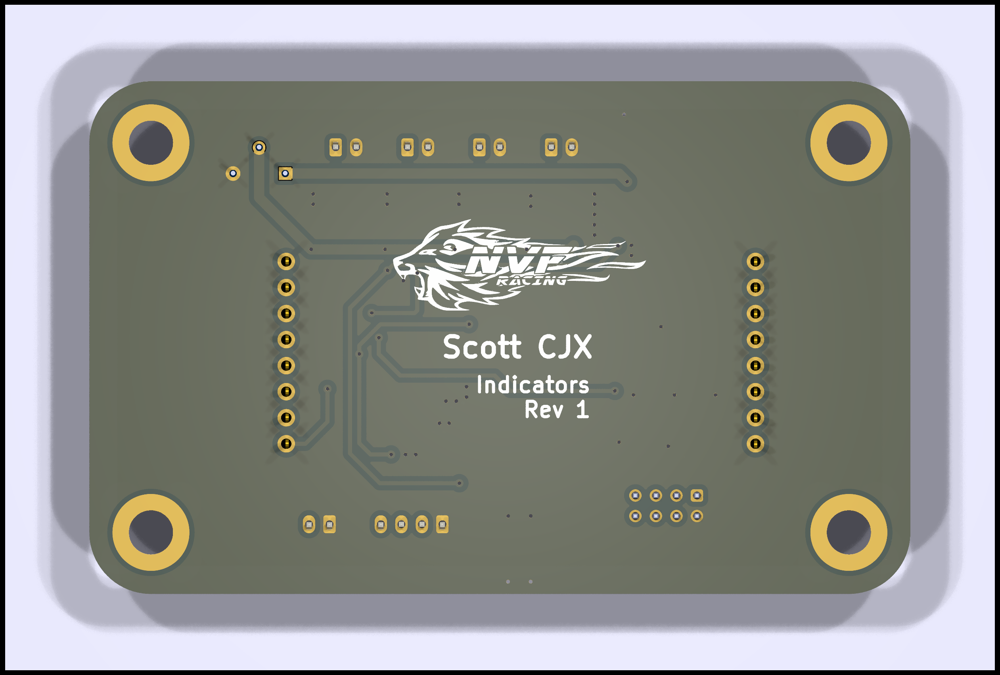
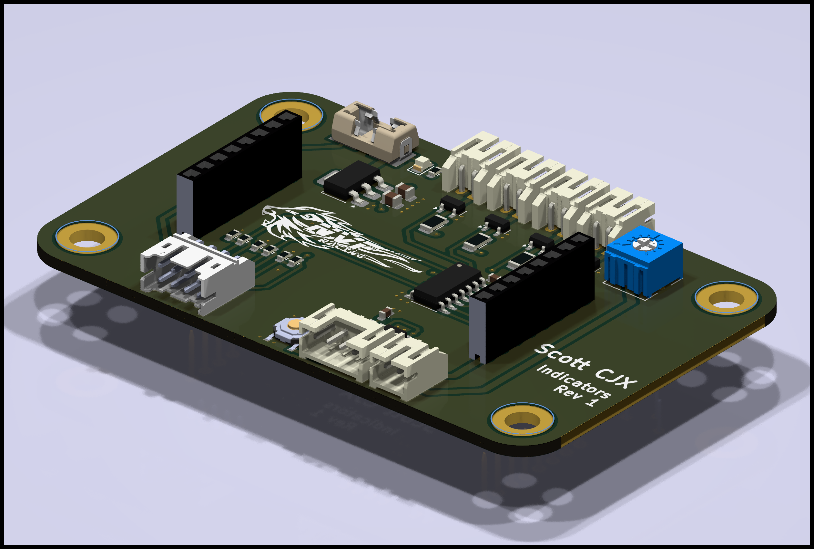

# SCS Indicators (Rev 1.0)

This repository contains all documents regarding the Small General board.

### Shortcuts

- [Schematics](#Schematics)
- [Assembly](#Assembly)
- [Renders](#Renders)
- [Bom](#Bom)

---

## Schematics

## Assembly

## Renders

## Bom

[Interactive BOM](./ibom/NVF2-SCS-Check-Indicate-ibom.html)

[BOM](./bom/NVF2-SCS-Check-Indicate-BOM.csv)
